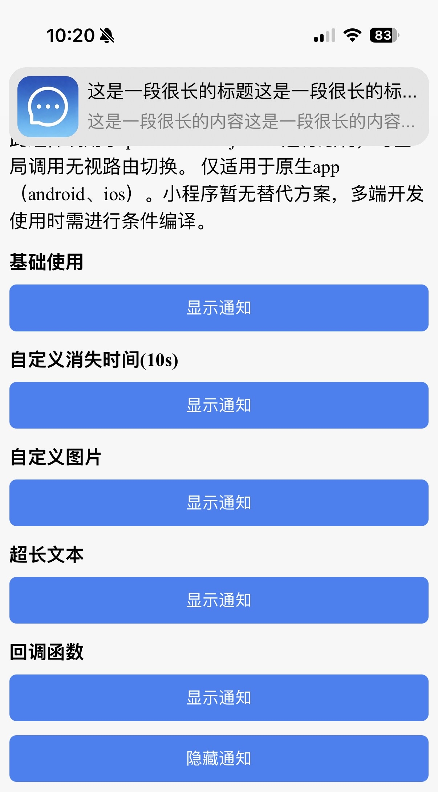

# 消息通知 <Badge type="warning" text="仅原生APP支持" />

App内需要顶部消息提醒的场景使用

::: warning 提示

组件调用 `new plus.nativeObj.View()` API进行绘制，小程序不支持，多端开发使用时需进行条件编译

由于安卓在API处理上存在问题，现仅支持上划关闭。已向官方反馈，修复后将进行更新 [反馈地址](https://ask.dcloud.net.cn/question/216411)

:::

## 基础使用

引入 `import MessageNotify from '@/utils/MessageNotify'`，由 `ts` 层面发起调用，无需写dom



```ts
<script setup lang="ts">
import MessageNotify from '@/utils/MessageNotify'
import { toast } from '@/utils/toast'

// 显示通知
const show = (title?: string, content: string, image?: string, duration?: number) => {
  MessageNotify.show({
    title,
    content,
    duration,
    image,
  })
}

// 隐藏通知
const hide = () => {
  MessageNotify.hide()
}

// 带回调的示例
const callbackShow = () => {
  MessageNotify.show(
    { content: '测试内容' },
    () => {
      toast('点击了通知')
    },
    (direction) => {
      toast('滑动方向：' + direction)
    }
  )
}
</script>
```


## API

### MessageNotify.show

显示通知

| 参数位置   | 描述                 | 参数说明                                                     |
| ---------- | -------------------- | ------------------------------------------------------------ |
| 第一个参数 | 通知内容配置         | notifyContent: NotifyContent                                 |
| 第二个参数 | 点击通知回调（可选） | clickCallback?: () => void                                   |
| 第三个参数 | 滑动结束回调（可选） | moveEndCallback?: (direction: 'top' \| 'right' \| 'bottom' \| 'left') => void |


### MessageNotify.hide

手动关闭当前通知

| 方法               | 描述     | 参数 |
| ------------------ | -------- | ---- |
| MessageNotify.hide | 关闭通知 | -    |


### NotifyContent 属性说明

以下属性作为 `MessageNotify.show` 的第一个参数，以对象形式传入

| 属性名   | 描述                 | 类型   | 默认值                                                       | 必填 |
| -------- | -------------------- | ------ | ------------------------------------------------------------ | ---- |
| title    | 通知标题             | string | '通知'                                                       | 否   |
| content  | 通知内容             | string | -                                                            | 是   |
| duration | 自动关闭时间（毫秒） | number | 3000                                                         | 否   |
| image    | 通知图片路径         | string | '_www/static/notice/MessageOutlined.png'<br />仅支持**本地路径**，如需使用网络图片，可通过 [获取附件临时地址](/doc-app/utils/utils.html#获取附件临时地址) 转换后再传入 | 否   |


### 回调说明

`MessageNotify.show` 支持传入两个可选回调函数

| 参数位置 | 触发时机                                     | 回调参数                                          |
| -------- | -------------------------------------------- | ------------------------------------------------- |
| 第二参数 | 用户点击通知时触发，触发后会自动关闭通知     | -                                                 |
| 第三参数 | 通知被滑动至阈值时触发，触发后会自动关闭通知 | direction: 'top' \| 'right' \| 'bottom' \| 'left' |

