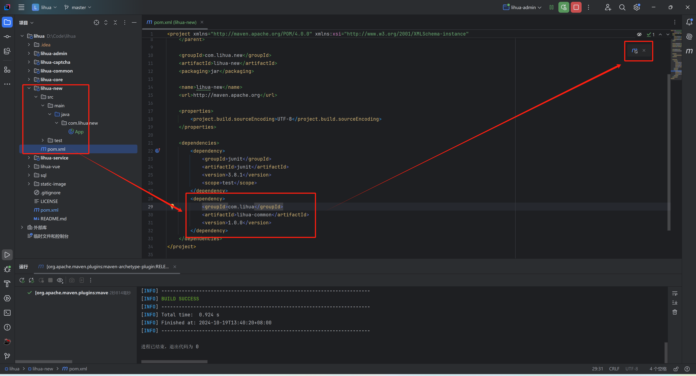
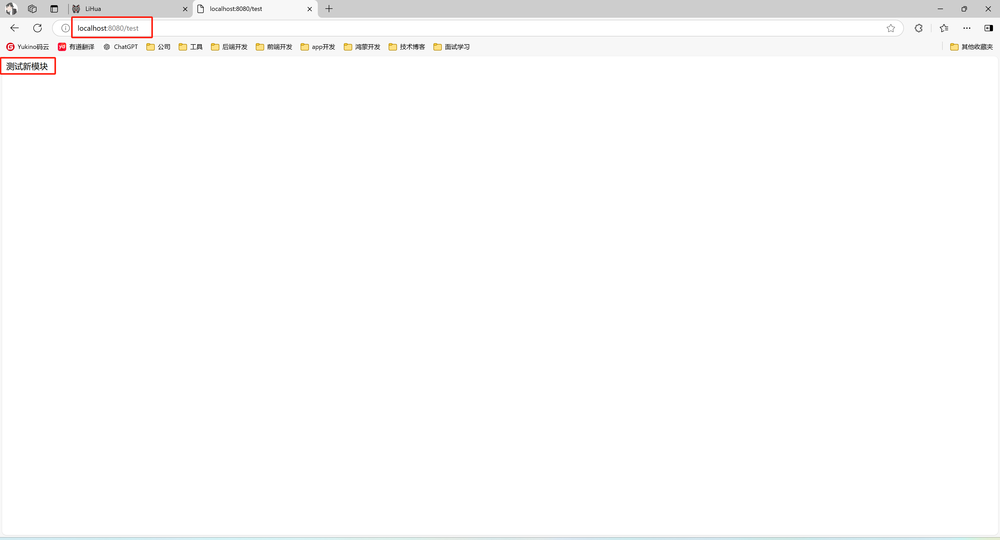

# 新增子模块

> 在业务开发中，为保证项目可维护性，通常新建子模块，在子模块中进行业务开发

1. 使用IDEA新建子模块，在项目最`父级目录右键->新建->模块`

   

2. 选择左侧 Java，填好名称，构建系统选择Maven，点击创建

   

3. 创建后可以看到新模块目录结构，根据需求可自行修改。创建完成后全局pom会自动添加新模块的module信息

   

4. 修改新模块项目结构、引入`lihua-common`依赖，`lihua-common` 为全局通用依赖，新模块需引入该依赖。引入完成后刷新Maven

   

5. `lihua-admin` 中添加新模块的依赖，`lihua-admin` 中包含系统启动类，需在此模块下引入系统所有模块，引入完成后刷新Maven

   

6. 测试，新建测试 controller，验证请求是否能进入

   

7. 默认没有携带`token`的请求会被 `SpringSecurity` 拦截，可在`lihuacore/com/lihua/config/SecurityConfig` 下新增临时白名单

   

8. 测试完成，通过url后端返回内容即表示新模块增加完成，可以进行业务开发了

   