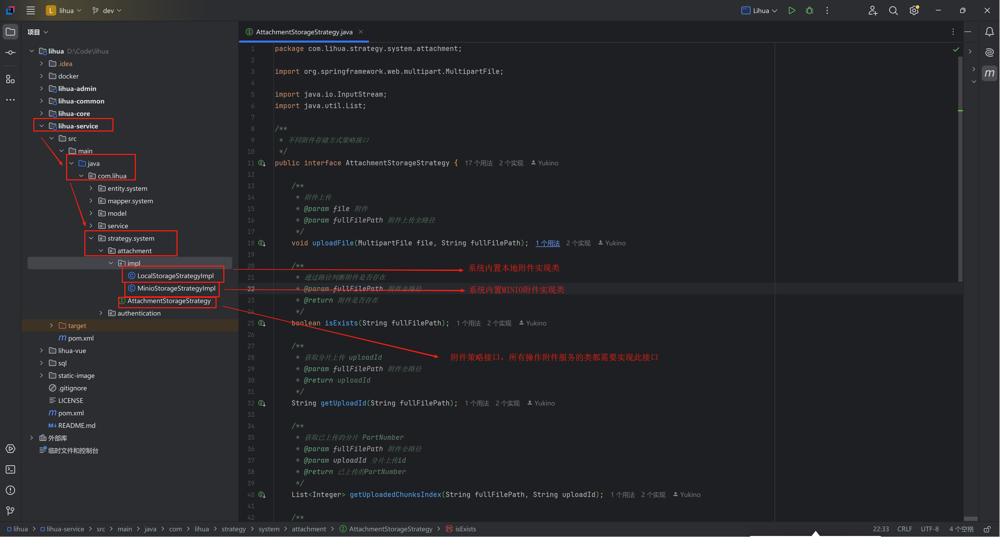

# 系统附件

> 附件接口 `com/lihua/controller/system/SysAttachmentStorageController.java` 与前端 `attachment-upload` 组件进行交互
>
> 该接口包含 `attachment-upload` 组件中 附件上传（一般上传|分片上传|断点续传|文件秒传）、附件回显、附件删除、附件预览/下载 等功能

> 系统提供本地附件、MINIO对象存储。通过配置文件可进行切换

## 附件配置

``` yaml
 # 系统配置
lihua:
	...
  # 文件上传服务类型：LOCAL（传统本地上传）、MINIO（Minio对象存储）
  uploadFileModel: LOCAL
  # 公开文件的业务编码，publicLocalDownload 中判断包含业务编码的文件才会进行返回
  uploadPublicBusinessCode: [UserAvatar, SystemNotice]
  # 上传文件路径 mac windows 注意目录切换
  uploadFilePath: D:/home/lihua/
  # 文件导出路径
  exportFilePath: D:/home/lihua/export/
  ...
```

- `lihua.uploadFileModel`指定文件服务类型，可选 LOCAL（本地）、MINIO（minio）。可自行扩展其他第三方服务。
- `lihua.uploadPublicBusinessCode` 指定可公开访问附件的业务编码。业务编码可由前端指定，默认为当前页面的路由名称。设置为公开的文件可通过`system/attachment/storage/download/p/{id}` 进行下载。
- `lihua.uploadFilePath` 附件上传目录
- `lihua.exportFilePath` excel 导出目录

## 扩展其他附件服务

> 在 `com/lihua/strategy/system/attachment/impl` 下新增 `AttachmentStorageStrategy` 接口实现类，根据传入参数进行上传/下载等业务逻辑编写，按要求返回参数即可。



AttachmentStorageStrategy 接口共有 9 个抽象方法（其中四个为分片上传相关，不需要分片上传可在实现类中直接抛出异常，反正调用不到）

- `void uploadFile(MultipartFile file, String fullFilePath)` 一般附件上传，接收一个附件对象和全路径。将附件上传到对应路径即可
- `boolean isExists(String fullFilePath)` 通过全路径判断附件是否存在，返回 true 或 false
- `String getUploadId(String fullFilePath)` 通过全路径获取分片上传 uploadId （不需要分片上传的话直接抛出异常就行）
- `List<Integer> getUploadedChunksIndex(String fullFilePath, String uploadId)`  通过全路径和uploadId 获取已上传附件的索引值，用于断点续传（不需要分片上传的话直接抛出异常就行）
- `void chunksUploadFile(MultipartFile file, String fullFilePath, Integer index, String uploadId)` 附件分片上传，接收附件、全路径、当前附件索引值、uploadId （不需要分片上传的话直接抛出异常就行）
- `void chunksMerge(String fullFilePath, String md5, String uploadId, Integer total)` 分片合并，分片全部上传完毕后前端会调用此方法进行附件合并，接收 全路径、附件md5（用于完整性校验）、uploadId、附件总分片数（不需要分片上传的话直接抛出异常就行）
- `void delete(String fullFilePath)` 根据全路径删除附件
- `String getDownloadURL(String fullFilePath, String originName, int expiryInMinutes)` 获取附件下载URL，接收附件全路径、原文件名、过期时间（分钟）
- `InputStream download(String fullFilePath)` 通过全路径名获取附件对应InputStream，用于附件下载


::: info

 扩展完成后若无其他需求就不用改动其他代码，直接使用  [附件上传](document/component/ATTACHMENT-UPLOAD.md) 组件即可

调用SysAttachmentStorageController下的附件上传接口，按要求传递参数，附件会进入【附件管理】

:::