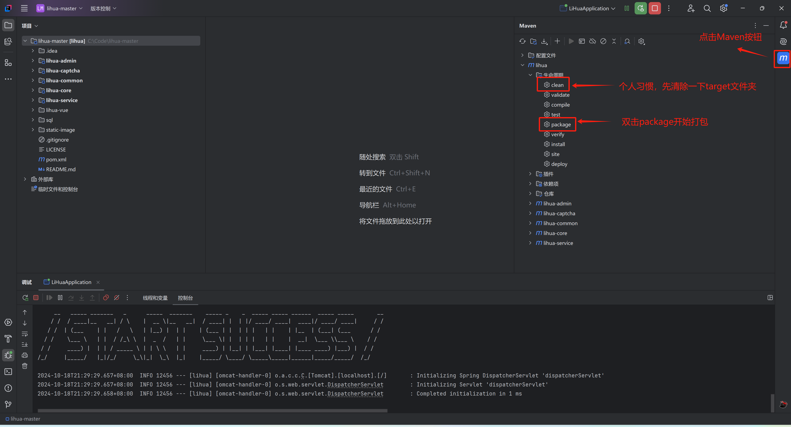

# 打包部署

::: info

打包前请确认配置文件设置是否为生产环境

:::

1. 打包，找到IDEA右侧 `Maven` 按钮，在`lihua/生命周期` 下先点击`clean` 后控制台会打印清空log，清空完成后点击`package`进行项目打包

   

2. 打包成功，后控制台会输出 `BUILD SUCCESS` 同时 `lihua-admin` 子项目下会生成 `lihua-admin-exec.jar` 将此jar包部署到服务器即可

   

3. 服务器启动，将jar包拷贝到服务器，运行 `java -jar jar包路径` 启动成功即部署完成（云服务器请确认控制面板的入栈配置及系统防火墙/入站规则端口）

   
