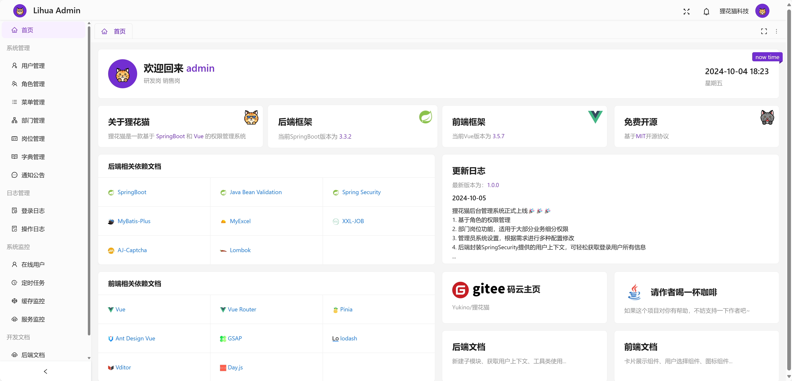

# Lihua Vue

狸花猫后台管理系统，基于Vue3 TypeScript开发


## ✨ 功能特性

- 🆕 **持续更新**：持续监控依赖安全漏洞，及时跟进升级与修复
- 📢 **实时通信**：内置 WebSocket 消息推送机制，支持服务端向客户端实时推送消息
- 🧰 **工具集合**：提供树形结构处理、数据字典翻译、附件下载等高频通用工具
- 🎨 **高度可配置**：支持全局暗色模式、主题色定制、毛玻璃虚化效果、导航布局等个性化配置
- 🧩 **内置扩展组件**：内置多种业务常用组件，如卡片展开、用户选择、附件上传等，开箱即用


## 🛠️ 技术特性

- 🖖 **Vue 3**：基于 Composition API 的现代前端框架
- 🧑‍💻 **TypeScript**：提供完善的类型系统，提升可维护性与开发体验
- 🧱 **Ant Design Vue**：企业级 UI 组件库，统一交互与视觉规范
- 🧠 **Pinia**：新一代状态管理方案，轻量且直观


## 🧩 组件库

- **UI 组件库**：[ant-design-vue](https://antdv.com/components/overview-cn)


## 📦 在线体验

- 👉 [点击访问](https://lihua.xyz/login)


## 🖼️ 项目截图


::: info 部分截图

<div style="display:flex; flex-wrap:wrap; gap:8px;">
   	
    
    
    
</div>

:::


## 📁 项目目录结构

``` text
lihua-vue                 # 前端工程  
├── public                # 公共文件  
├── src                   # 工程主目录  
│    ├── api              # axios接口目录  
│    ├── assets           # 静态资源  
│    ├── components       # 公共组件  
│    ├── directive        # vue指令  
│    ├── layout           # layout布局  
│    ├── router           # 路由  
│    ├── static           # 静态资源  
│    ├── stores           # pinia  
│    ├── utils            # 工具类  
│    ├── views            # 页面目录  
│    ├── App.vue          # vue主文件  
│    ├── main.ts          # vue 主入口配置文件  
│    ├── permission.ts    # 路由守卫  
│    ├── settings.ts      # 系统配置文件  
├── package.json          # 项目包管理文件  
├── tsconfig.json         # ts配置文件  
├── vite.config.ts        # vite配置文件  
```

## 📄 许可证

本项目采用 **MIT License** 开源协议，详情请查看 `LICENSE` 文件。