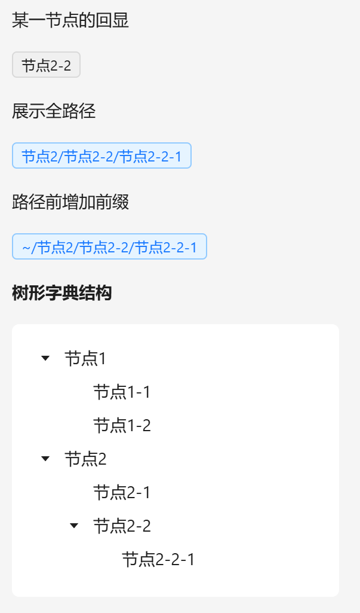

# 字典标签

列表或页面中涉及字典翻译时使用

## 基础用法

1. 引入组件 `import DictTag from "@/components/dict-tag/index.vue"`
2. 引入方法 `import {initDict} from "@/utils/Dict"`，初始化字典选项 `const {sys_status} = initDict("sys_status")`
3. 设置字典选项 `:dict-data-option="sys_status"`
4. 设置需要被翻译的值 `dict-data-value="0"`


```vue
<template>
  <a-typography-title :level="4">最简单的字典回显</a-typography-title>
  <dict-tag dict-data-value="0" :dict-data-option="sys_status"/>
  <dict-tag dict-data-value="1" :dict-data-option="sys_status"/>
</template>

<script setup lang="ts">
import DictTag from "@/components/dict-tag/index.vue"
import {initDict} from "@/utils/Dict.ts"
const {sys_status} = initDict("sys_status")
</script>
```

## 树形字典回显

树形字典可通过配置`full-tree-node`属性来展示单节点或全路径，`root-tree-node-prefix`属性可指定根节点前缀



```vue
<template>
  <a-typography-title :level="4">树形字典回显</a-typography-title>
  <a-typography>某一节点的回显</a-typography>
  <dict-tag dict-data-value="2-2" :dict-data-option="test_tree"/>
  <a-typography>展示全路径</a-typography>
  <dict-tag dict-data-value="2-2-1" :dict-data-option="test_tree" full-tree-node/>
  <a-typography>路径前增加前缀</a-typography>
  <dict-tag dict-data-value="2-2-1" :dict-data-option="test_tree" full-tree-node root-tree-node-prefix="~"/>

  <a-typography-text strong>树形字典结构</a-typography-text>
  <a-row>
    <a-col :span="4">
      <a-tree style="padding: 16px"
              v-if="test_tree.length"
              :tree-data="test_tree"
              :field-names="{children:'children', title:'label'}"
              default-expand-all/>
    </a-col>
  </a-row>
</template>

<script setup lang="ts">
import DictTag from "@/components/dict-tag/index.vue"
import {initDict} from "@/utils/Dict.ts"
const {test_tree} = initDict("test_tree")
</script>
```

## API

### 属性

| 属性名称           | 描述               | 类型              | 默认值                | 是否必填 |
| ------------------ | ------------------ | ----------------- | --------------------- | -------- |
| dictDataOption     | 字典集合           | SysDictDataType[] | -                     | 是       |
| dictDataValue      | 被翻译的字典值     | string            | -                     | 是       |
| bordered           | 标签是否有边框     | boolean           | true                  | 否       |
| style              | 自定义标签样式     | Object            | { 'margin-right': 0 } | 否       |
| fullTreeNode       | 展示树型结构全路径 | boolean           | false                 | 否       |
| fullTreeSeparator  | 树型结构分隔符     | string            | /                     | 否       |
| rootTreeNodePrefix | 树型跟节点前缀节点 | string            | ''                    | 否       |