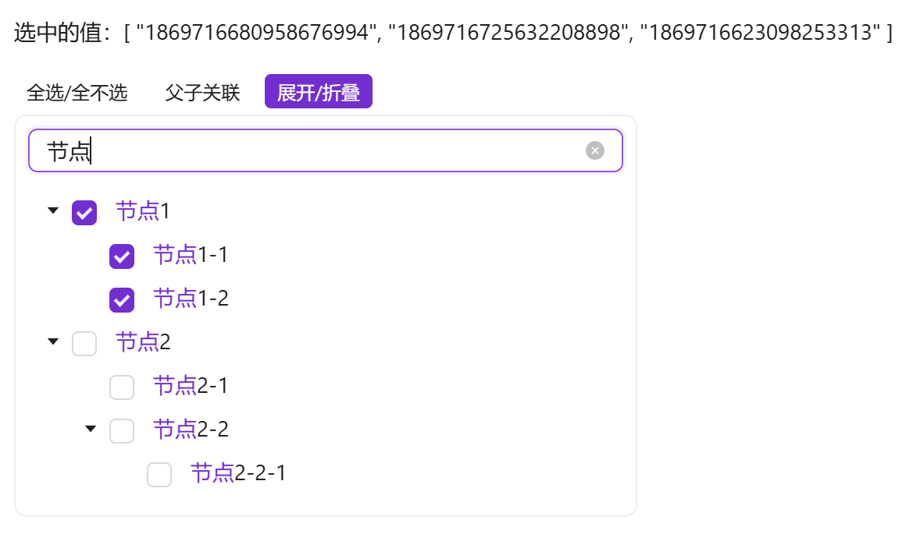

# 简单树形选择

表单中需要可筛选关键字的树形选择时使用

::: info 提示

`a-tree`使用双向绑定时有多种类型（选中复选框/展开折叠/选中）而且单选和多选绑定返回的数据结构差异较大。所以将最常用的功能进行封装，单选绑定定义的key值，多选绑定key值数组。另外也将展开折叠、父子关联、全选功能也进行了封装，不需要对应功能时可通过属性关闭

`a-tree`官方案例中有关键字检索的例子，但是由业务代码实现的，组件本身并没有封装。当多个业务都需要筛选树时，会造成重复代码过多的情况。所以将此功能也封装到组件中，不需要的话可通过属性关闭

:::


## 基础用法

引入组件`import EasyTreeSelect from '@/components/easy-tree-select/index.vue'` 使用`tree-data`树形即可展示树形结构，使用`v-model`双向绑定获取选中的`key`值，默认为多选，v-model绑定的值为key值数组。

需确保`tree-data`属性传入的值是有效的。如果通过双向绑定或异步获取的值，需在组件中使用 ` v-if="data && data.length > 0"`



```vue
<template>
  <a-typography-title :level="4">最简单的树形选择</a-typography-title>
  <a-typography-text>选中的值：{{value}}</a-typography-text>
  <a-row>
    <a-col :span="6">
      <easy-tree-select v-if="test_tree.length > 0" :tree-data="test_tree" v-model="value"/>
    </a-col>
  </a-row>
</template>
<script setup lang="ts">
import EasyTreeSelect from '@/components/easy-tree-select/index.vue'
import {initDict} from "@/utils/Dict.ts"
import {ref} from "vue";
const {test_tree} = initDict("test_tree")
const value = ref<string[]>([])
</script>
```

## 单选的属性选择

使用 ` :multiple="false"` 来指定属性结构为单选模式，这时v-model绑定的值为key值


```vue
<template>
  <a-typography-title :level="4">单选树形结构</a-typography-title>
  <a-typography-text>选中的值：{{value}}</a-typography-text>
  <a-row>
    <a-col :span="6">
      <easy-tree-select v-if="test_tree.length > 0" :tree-data="test_tree" v-model="value" :multiple="false"/>
    </a-col>
  </a-row>
</template>
<script setup lang="ts">
import EasyTreeSelect from '@/components/easy-tree-select/index.vue'
import {initDict} from "@/utils/Dict.ts"
import {ref} from "vue";
const {test_tree} = initDict("test_tree")
const value = ref<string>()
</script>
```

## 使用自定义插槽

可自定义节点显示插槽，通过` #title="{keyword, id, label}" `可获取到关键词 `keyword` 及每个节点的`item属性`


```vue
<template>
  <a-typography-title :level="4">自定义插槽</a-typography-title>
  <a-typography-text>选中的值：{{value}}</a-typography-text>
  <a-row>
    <a-col :span="6">
      <easy-tree-select v-if="test_tree.length > 0" :tree-data="test_tree" v-model="value">
        <template #title="{keyword,id,label}">
          {{label + ' [' + id + ']'}}
        </template>
      </easy-tree-select>
    </a-col>
  </a-row>
</template>
<script setup lang="ts">
import EasyTreeSelect from '@/components/easy-tree-select/index.vue'
import {initDict} from "@/utils/Dict.ts"
import {ref} from "vue";
const {test_tree} = initDict("test_tree")
const value = ref<string[]>([])
</script>
```

## API

### 双向绑定

| 属性名称 | 描述     | 类型                                          | 默认值 | 是否必填 |
| -------- | -------- | --------------------------------------------- | ------ | -------- |
| v-model  | 双向绑定 | 与Key定义类型相同（单选） Key类型数组（多选） | -      | 是       |

### 属性

| 属性名称          | 描述                  | 类型                                             | 默认值                                              | 是否必填 |
| ----------------- | --------------------- | ------------------------------------------------ | --------------------------------------------------- | -------- |
| treeData          | 可选的树形结构数据    | 具有属性结构的数组                               | -                                                   | 是       |
| fieldNames        | 树形结构字段对应别名  | \{children: string, title: string, key: string\} | \{children: 'children', title: 'label', key: 'id'\} | 否       |
| defaultExpandAll  | 默认展开全部（1.2.5） | boolean                                          | false                                               | 否       |
| checkStrictly     | 父子关联（1.2.5）     | boolean                                          | false                                               | 否       |
| multiple          | 是否多选              | boolean                                          | true                                                | 否       |
| showToolbar       | 显示工具栏            | boolean                                          | true                                                | 否       |
| showSearch        | 显示搜索框            | boolean                                          | true                                                | 否       |
| searchPlaceholder | 搜索框提示词          | string                                           | 请输入关键词                                        | 否       |
| bodyStyle         | 树形卡片body样式      | Object                                           | \{padding: '8px',borderRadius: '8px'\}              | 否       |
| maxHeight         | 最大高度              | number                                           | -                                                   | 否       |
| bordered          | 是否展示边框          | boolean                                          | true                                                | 否       |

### 插槽

| 插槽名称 | 描述               | 返回参数                | 是否必须 |
| -------- | ------------------ | ----------------------- | -------- |
| title    | 自定义树形节点插槽 | keyword及各个节点属性值 | 否       |

### 方法

| 方法名称 | 描述             | 参数                                  |
| -------- | ---------------- | ------------------------------------- |
| change   | 选中值变化时触发 | 选中的key（单选为key，多选为key数组） |