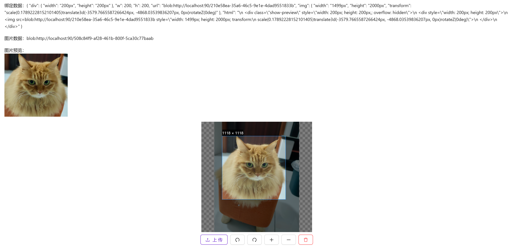

# 图片裁剪

需要进行图片裁剪时使用

::: info 提示

此组件为`vue-cropper`的二次封装，如需修改组件，请参考[官方文档](https://github.xyxiao.cn/vue-cropper/)

双向绑定`v-model:realTime`并不适合绑定直接存储到数据库的字段，主要用于获取到返回对象进行预览

双向绑定`v-model:img`并不适合绑定直接存储到数据库的字段，主要用于图片回显和删除图片时将绑定属性值一并删除

:::


## 基础用法

引入组件`import ImageCropper from "@/components/image-cropper/index.vue"`通过`v-model:real-time`获取实时预览的图片对象。通过`v-model:img="image"`获取上传的图片临时地址，可用于判断是否已上传了图片



```vue
<template>
  <a-typography-title :level="4">基础用法</a-typography-title>
  <a-typography-text>绑定数据：{{value}}</a-typography-text>
  <a-typography-text>图片数据：{{image}}</a-typography-text>
  <a-typography-text>图片预览：  <div v-if="value && value.html" v-html="value.html"></div></a-typography-text>

  <image-cropper v-model:real-time="value" v-model:img="image"/>
</template>

<script setup lang="ts">
import ImageCropper from "@/components/image-cropper/index.vue"
import type {CropperDataType} from "@/components/image-cropper/CropperType.ts";
import {ref} from "vue";
const value = ref<CropperDataType>()
const image = ref<string>()
</script>
```

## 完整使用

一般来说存储到数据库的数据为图片地址，需配合组件获取二进制文件后上传到服务器，保存文件上传后返回的地址。需要使用按钮或其他方式调用上传文件的函数

```vue
<template>
  <image-cropper v-model:img="image" ref="imageCropperRef"/>
  <a-button @click="handleUpload">上 传</a-button>
</template>

<script setup lang="ts">
import ImageCropper from "@/components/image-cropper/index.vue"
import {ref, useTemplateRef} from "vue";
import {message} from "ant-design-vue";
import {upload} from "@/api/system/file/File.ts";
// 图片裁剪组件的ref
const imageCropperRef = useTemplateRef<InstanceType<typeof ImageCropper>>("imageCropperRef")
const image = ref()

// 处理上传图片
const handleUpload = async () => {
  // 判断图片是否上传
  if (!image.value) {
    message.error("请上传图片")
    return;
  }
  // 判断图片剪裁组件是否加载正常
  if (!imageCropperRef.value) {
    message.error("image-cropper 实例加载失败")
    return;
  }

  // 通过ref调用到getBlob()方法获取裁剪后的图片二进制文件
  const blob = await imageCropperRef.value.getBlob()

  if (!blob) {
    message.error("获取blob失败")
    return;
  }

  // 调用upload方法将文件上传到服务器
  const resp = await upload(blob as Blob);

  if (resp.code === 200) {
    message.error("图片上传失败")
    return;
  }

  // 最终获取服务器中的图片地址，可保存到数据库
  const imagePath = resp.data
}
</script>
```

## API

### 双向绑定

| 属性名称          | 描述                         | 类型            | 默认值 | 是否必填 |
| ----------------- | ---------------------------- | --------------- | ------ | -------- |
| v-model:real-time | 获取实时剪裁的图片信息       | CropperDataType | -      | 否       |
| v-model:img       | 获取上传的图片浏览器临时地址 | string          | -      | 否       |

### 属性

| 属性名称       | 描述                                    | 类型                              | 默认值  | 是否必填 |
| -------------- | --------------------------------------- | --------------------------------- | ------- | -------- |
| outputSize     | 裁剪生成的图片质量（0.1 ~ 1）           | number                            | 1       | 否       |
| outputType     | 裁剪生成图片的格式（jpeg\| png\| webp） | string                            | png     | 否       |
| info           | 裁剪框的大小信息                        | boolean                           | true    | 否       |
| canScale       | 图片是否允许滚轮缩放                    | boolean                           | true    | 否       |
| autoCrop       | 是否默认生成截图框                      | boolean                           | true    | 否       |
| autoCropWidth  | 默认生成截图框宽度                      | number                            | 200     | 否       |
| autoCropHeight | 默认生成截图框高度                      | number                            | 200     | 否       |
| fixedBox       | 固定截图框大小 不允许改变               | boolean                           | true    | 否       |
| fixed          | 是否开启截图框宽高固定比例              | boolean                           | true    | 否       |
| fixedNumber    | 截图框的宽高比例 [ 宽度 , 高度 ]        | Array                             | [1, 1]  | 否       |
| canMove        | 上传图片是否可以移动                    | boolean                           | true    | 否       |
| canMoveBox     | 截图框能否拖动                          | boolean                           | true    | 否       |
| original       | 上传图片按照原始比例渲染                | boolean                           | false   | 否       |
| centerBox      | 截图框是否被限制在图片里面              | boolean                           | true    | 否       |
| infoTrue       | 是否展示真实输出图片宽高                | boolean                           | true    | 否       |
| full           | 是否输出原图比例的截图                  | boolean                           | true    | 否       |
| enlarge        | 图片根据截图框输出比例倍数              | number                            | 1       | 否       |
| mode           | 图片默认渲染方式                        | contain , cover, 100px, 100% auto | contain | 否       |
| wight          | 组件宽度                                | string                            | 350px   | 否       |
| height         | 组件高度                                | string                            | 350px   | 否       |